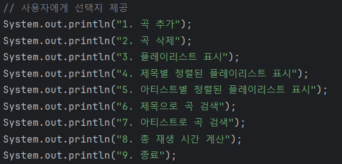

# 자료구조 자바 컬렉션 활용 미니 프로젝트

---

## **팀 구성**
- 김나연
- 김유림
- 유동건

## **프로젝트 개요**
이 프로젝트는 자바 컬렉션 프레임워크를 활용하여 음악 플레이리스트를 관리하는 프로그램입니다. 사용자는 곡을 추가하고, 삭제하며, 다양한 기준으로 곡을 검색하고 정렬할 수 있습니다. 또한, 총 재생 시간을 계산하는 기능도 포함되어 있습니다.

## **시스템 구성**

### **Song 클래스**
- **기능**: 곡의 제목, 아티스트, 앨범, 재생 시간을 포함합니다.
- **메서드**:
    - `getTitle()`: 곡 제목 반환
    - `getArtist()`: 아티스트 반환
    - `getAlbum()`: 앨범 반환
    - `getDuration()`: 재생 시간 반환
    - `toString()`: 곡 정보를 문자열로 반환

### MusicPlaylist
- 사용한 컬렉션 프레임워크 : Hashmap, Treeset
- 노래를 추가, 제거
- 노래를 출력(기준 : 전체 or 제목 or 아티스트)
- 노래 검색(기준 : 곡 제목 or 아티스트)
- 총 재생 시간 계산

### **MusicPlaylist 클래스**
- **사용한 컬렉션 프레임워크**: `HashMap`, `TreeSet`
- **기능**:
    - 추가: `addSong(Song song)`
    - 제거: `removeSong(String title)`
    - 출력: `playlist()`, `playlistByTitle()`, `playlistByArtist()`
    - 검색: `searchByTitle(String title)`, `searchByArtist(String artist)`
    - 총 재생 시간 계산: `getTotalDuration()`
- **설명**:
    - `HashMap`을 사용하여 곡 제목을 키로 곡 정보를 저장합니다.
    - `TreeSet`을 사용하여 곡 제목 및 아티스트별로 정렬된 곡 리스트를 관리합니다.

### Main
- **기능**: 사용자 입력을 받아 다양한 플레이리스트 기능을 실행합니다.
- **설명**:
  사용자가 입력하는 숫자에 따라 기능을 실행합니다. 초기 곡 데이터를 배열로 저장하여 시작합니다.

